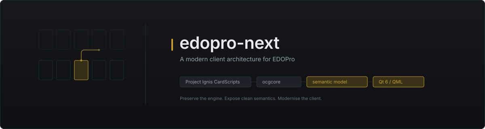
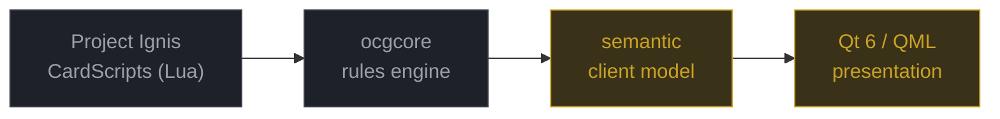
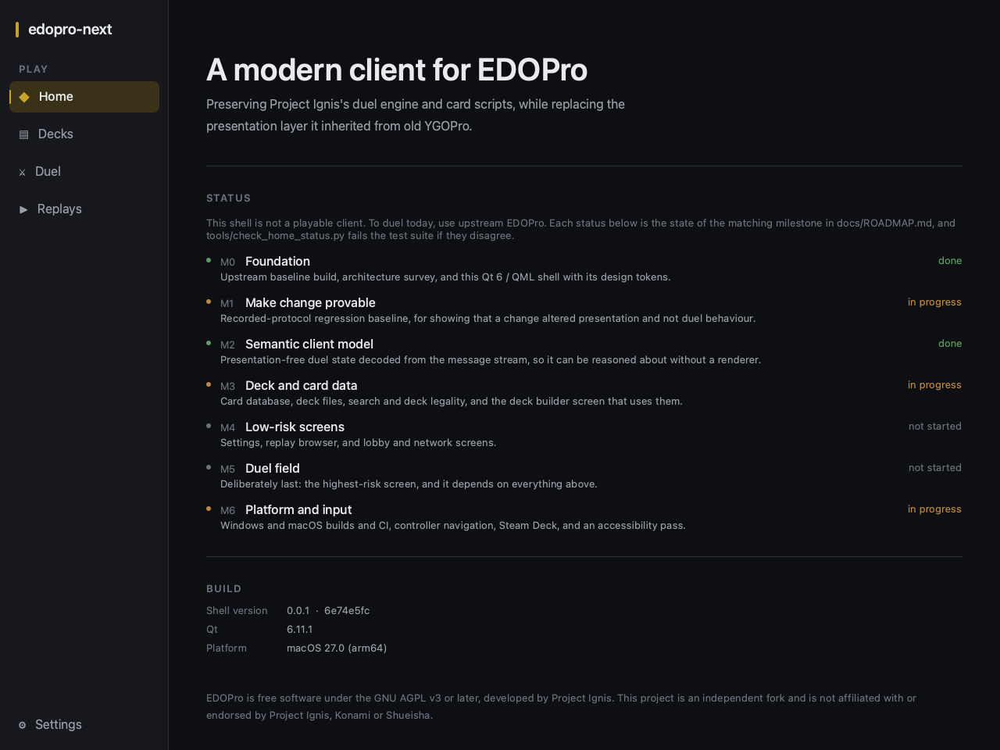

<div align="center">



<br>

**Preserve the engine. Expose clean semantics. Modernise the client.**

<br>

[](https://github.com/cntrl-alt-lenny/edopro-next/actions/workflows/edopro-next.yml)
[](docs/ROADMAP.md)
[](docs/ROADMAP.md)
[](docs/adr/0001-ui-runtime-stack.md)
[](ui/)
[](LICENSE)

</div>

---

> [!IMPORTANT]
> **Early development. This is not yet a playable replacement for EDOPro.**
>
> There is no duel field, no deck builder, and no way to play a game. What exists is an
> architecture, a verified build baseline, a regression harness, and one compiled UI shell.
>
> **If you want to duel today, use [EDOPro](https://github.com/edo9300/edopro).** This
> project would not exist without it.

## What this changes, and what it does not

EDOPro automates one of the most rules-dense card games ever designed, across the entire
card pool, maintained by volunteers over years. **That part already works, and this project
does not touch it.**



<div align="center"><sub>Grey is preserved upstream work. Gold is what this project builds.</sub></div>

<br>

What has aged is the layer around the engine. The client descends from YGOPro:
fixed-coordinate widgets on a patched Irrlicht 1.8, sized by manual DPI scaling rather
than a layout system, with no accessibility layer, no declarative focus model and no
animation framework. Those are consequences of a toolkit choice made long ago, not
failures of effort.

## The shell today

A real screenshot of the compiled application — not a mockup.

<div align="center">

</div>

<div align="center"><sub>Captured from the running binary via <code>--capture</code>. Every status shown is real, and four of five subsystems say <em>planned</em>.</sub></div>

## Why edopro-next?

<table>
<tr>
<td width="33%" valign="top">

### Preserve

`ocgcore` and Project Ignis's Lua CardScripts stay **authoritative and untouched**. The
engine boundary is already a clean C ABI over a byte protocol, so a new client needs no
engine changes at all.

</td>
<td width="33%" valign="top">

### Separate

Upstream fuses protocol decode, state, animation and widgets in one 4,658-line function,
and stores render transforms in the same struct as a card's attack value. **Semantic state
gets its own layer.**

</td>
<td width="33%" valign="top">

### Modernise

Qt 6 / QML: responsive layouts instead of fixed coordinates, a real animation framework,
declarative and testable focus, native accessibility, and high-DPI handled by the toolkit.

</td>
</tr>
</table>

## What exists today

Nothing here is rounded up.

| | Status | |
|---|---|---|
| Upstream baseline builds and runs | ✅ **Working** | `EDOPro version 41.0.2` — [record](docs/BASELINE.md) |
| Architecture survey of upstream | ✅ **Working** | read from source — [survey](docs/architecture/current-edopro.md) |
| UI stack decision | ✅ **Decided** | Qt 6 / QML — [ADR 0001](docs/adr/0001-ui-runtime-stack.md) |
| Qt 6 / QML shell | ✅ **Working** | compiles, runs, zero QML errors |
| Design token system | ✅ **Working** | [`Theme.qml`](ui/qml/Theme.qml) |
| Replay regression harness | ✅ **Working** | golden traces over real duels — [how](docs/architecture/replay-regression.md) |
| Linux CI | ✅ **Working** | harness, Qt shell, upstream baseline |
| Semantic client model | ⬜ Not started | next milestone after M1 |
| Deck builder | ⬜ Not started | first screen to migrate |
| Duel field | ⬜ Not started | deliberately last |
| Windows / macOS builds | ⬜ Not attempted | Linux only so far |

## Proving behaviour does not change

The property this project most needs to be able to assert:

> **this changed presentation, not duel behaviour**

Real recorded duels are replayed into a deterministic text trace and compared against
golden files. A behavioural change produces a readable diff naming the exact message:

```diff
   62 MSG_SPSUMMONING              4
   63 MSG_SPSUMMONED               1
-  70 MSG_CHAINING                 7
+  70 MSG_CHAINING                 8
   71 MSG_CHAINED                  8
```

Two fixtures cover turn progression, normal/special/set summons, **chains**, targeting,
card movement, battle and damage steps, draws, reveals and a terminal win. They are
sanitised real duels — no player identity, no card artwork, ~5 KB each. The harness is
Python standard library only, runs headlessly in under a second, and needs neither
`ocgcore` nor card data. See [the investigation](docs/architecture/replay-regression.md)
for why that is possible and where its limits are.

## Architecture

```
gframe/          legacy Irrlicht client        upstream — touch minimally
ocgcore/         rules engine (submodule)      upstream — do not touch
ui/              Qt 6 / QML presentation       ours
tools/           Python tooling and harness    ours
tests/           fixtures and golden traces    ours
docs/            architecture, ADRs, roadmap   ours
```

New code lives in new directories, specifically so upstream merges stay tractable.

**Read next:** [architecture survey](docs/architecture/current-edopro.md) ·
[ADR 0001: UI stack](docs/adr/0001-ui-runtime-stack.md) ·
[replay regression](docs/architecture/replay-regression.md) ·
[upstream policy](docs/UPSTREAM.md)

## Design principles

> **The cards are the product.**
> Chrome exists to present artwork and communicate rules state, then get out of the way.

> **The rules engine must not become the UI. The UI must not implement game rules.**
> UI code never decides legality, never computes what is targetable, never infers rules.

> **Motion communicates state change. It is never decoration.**
> And it must never obscure what is legal.

The full system — colour, spacing, typography, motion, focus — is in
[docs/DESIGN_SYSTEM.md](docs/DESIGN_SYSTEM.md).

## Roadmap

| | Milestone | |
|:--|:--|:--|
| **M0** | Foundation — architecture, baseline, ADR, shell | ✅ done |
| **M1** | **Make change provable** — regression harness, CI | 🔶 in progress |
| **M2** | Semantic client model — presentation-free duel state | ⬜ |
| **M3** | Deck and card data — the first screen to migrate | ⬜ |
| **M4** | Low-risk screens — settings, replays, lobby | ⬜ |
| **M5** | Duel field — last, and highest risk | ⬜ |
| **M6** | Platform and input — Windows, macOS, controller, Steam Deck | ⬜ |

Sequenced so the repository is always in a usable state. Full detail, including what is
explicitly out of scope, in [docs/ROADMAP.md](docs/ROADMAP.md).

## Build

**Qt shell** — needs Qt 6.5+ (developed against 6.8.3 LTS):

```bash
cmake -S ui -B ui/build -G Ninja -DCMAKE_BUILD_TYPE=Release
cmake --build ui/build
./ui/build/edopro_next_shell
```

**Regression harness** — Python 3.10+, no dependencies:

```bash
python -m unittest discover -s tests -v
```

**Upstream client** — see [docs/BASELINE.md](docs/BASELINE.md) for the full record,
environment and the gotchas that cost real time.

## Credit

Everything that makes this project worth attempting was built by
**[Project Ignis](https://github.com/ProjectIgnis)** and
**[edo9300](https://github.com/edo9300)** — the duel engine, the card scripts, the
databases, and the years of correctness work behind them.

This project modernises a presentation layer. It does not reinvent the game.

Upstream's own README is preserved at [docs/upstream-README.md](docs/upstream-README.md);
the fork basis and merge policy are in [docs/UPSTREAM.md](docs/UPSTREAM.md).

## Licence

EDOPro is free software under the **GNU AGPL v3 or later**, and so is this fork. Upstream
copyright notices, [`LICENSE`](LICENSE), [`COPYING`](COPYING) and `notices/` are preserved
unchanged, and inherited code is not relicensed.

Card scripts, card databases and card artwork are **not** in this repository. They belong
to Project Ignis and other rights holders, and are fetched at runtime by the client.

**Yu-Gi-Oh! is a trademark of Shueisha and Konami.** This project is not affiliated with or
endorsed by Project Ignis, Konami or Shueisha.
