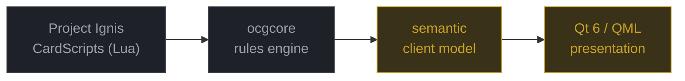

# Overview

What edopro-next changes, what it deliberately does not, and why. This page holds the
explanatory material that used to sit on the landing page ([`README.md`](../README.md)),
which is now short by design. Current status is generated on the landing page from
[`ROADMAP.md`](ROADMAP.md); the sentences below that describe status are dated and are
context, not the source of truth.

## Where the project stands

> **This is not a playable replacement for EDOPro.**
>
> There is no duel field and no way to play a game. A functional deck-builder core exists —
> search a loaded card pool, build Main/Extra/Side explicitly, open and save a `.ydk` — but
> its QML screen shows no deck legality, no artwork, and has no full keyboard/controller
> parity yet.
>
> **If you want to duel today, use [EDOPro](https://github.com/edo9300/edopro).** This
> project would not exist without it.

As of 2026-09-21, what exists besides the deck-builder core is an architecture survey of
upstream, a verified build baseline, a recorded-protocol regression harness, a
presentation-free semantic duel model with a reviewed equivalence check against the legacy
client (`client/`), a card database facade, deck and `.ydk` codec and card search (`data/`),
a presentation-independent deck legality module that nothing in `ui/` calls yet
(`policy/`), and a compiled Qt shell. [What exists today](capabilities.md) has the
detail; [`ROADMAP.md`](ROADMAP.md) is authoritative.

## What this changes, and what it does not

EDOPro automates one of the most rules-dense card games ever designed, across the entire
card pool, maintained by volunteers over years. **That part already works, and this project
does not touch it.**



<div align="center"><sub>Grey is preserved upstream work. Gold is what this project builds.</sub></div>

<br>

What has aged is the layer around the engine. The client descends from YGOPro:
fixed-coordinate widgets on a patched Irrlicht fork (1.8 lineage; it reports itself as
1.9.0), sized by manual DPI scaling rather than a layout system, with no accessibility
layer, no declarative focus model and no animation framework. Those are consequences of a
toolkit choice made long ago, not failures of effort. The evidence is in
[ADR 0001](adr/0001-ui-runtime-stack.md), the
[architecture survey](architecture/current-edopro.md) and [`BASELINE.md`](BASELINE.md).

## Why edopro-next?

<table>
<tr>
<td width="33%" valign="top">

### Preserve

`ocgcore` and Project Ignis's Lua CardScripts stay **authoritative and untouched**. The
engine boundary is already a clean C ABI over a byte protocol, so a new client needs no
engine changes at all.

</td>
<td width="33%" valign="top">

### Separate

Upstream fuses protocol decode, state, animation and widgets in one function of about
3,000 lines, and stores render transforms in the same struct as a card's attack value.
**Semantic state gets its own layer.**

</td>
<td width="33%" valign="top">

### Modernise

Qt 6 / QML: responsive layouts instead of fixed coordinates, a real animation framework,
declarative and testable focus, native accessibility, and high-DPI handled by the toolkit.

</td>
</tr>
</table>

The function is `DuelClient::ClientAnalyze` in `gframe/duelclient.cpp`. The survey measured
it at 2,977 lines (upstream `54ea755a`, [section 3](architecture/current-edopro.md)); in
this tree it spans lines 1287 to 4285, which is 2,999 lines, measured by brace matching on
2026-09-21. The growth comes from this project's own commits to that file since the survey
(the observer and verification seams, and null guards), listed by
`git log 54ea755a..HEAD -- gframe/duelclient.cpp`.

## Repository layout

```
gframe/               legacy Irrlicht client                       upstream — touch minimally
ocgcore/              rules engine (submodule)                     upstream — do not touch
integration/legacy/   C++17 observer seam that gframe may see       ours
client/               semantic duel model                          ours — no Qt, no Irrlicht
data/                 card database facade, .ydk codec, search     ours — no Qt, no Irrlicht
policy/               deck legality / LFList policy                ours — presentation-independent
ui/                   Qt 6 / QML presentation                      ours
tools/                Python tooling and harness                   ours
tests/                fixtures and golden traces                   ours
docs/                 architecture, ADRs, roadmap                  ours
```

New code lives in new directories, specifically so upstream merges stay tractable. The
ownership column follows [`CLAUDE.md`](../CLAUDE.md) ("Where code belongs").

**Read next:** [architecture survey](architecture/current-edopro.md) ·
[ADR 0001: UI stack](adr/0001-ui-runtime-stack.md) ·
[semantic model](architecture/semantic-model.md) ·
[ADR 0002: identity and events](adr/0002-semantic-event-model.md) ·
[replay regression](architecture/replay-regression.md) ·
[upstream policy](UPSTREAM.md)

## Design principles

> **The cards are the product.**
> Chrome exists to present artwork and communicate rules state, then get out of the way.

> **The rules engine must not become the UI. The UI must not implement game rules.**
> UI code never decides legality, never computes what is targetable, never infers rules.

> **Motion communicates state change. It is never decoration.**
> And it must never obscure what is legal.

The full system — colour, spacing, typography, motion, focus — is in
[`DESIGN_SYSTEM.md`](DESIGN_SYSTEM.md).

## Roadmap, in one line each

The landing page's hand-typed roadmap table was replaced by a generated status block and
this pointer. The milestones and their exit criteria are in [`ROADMAP.md`](ROADMAP.md),
sequenced so the repository is always in a usable state, including what is explicitly out
of scope.
